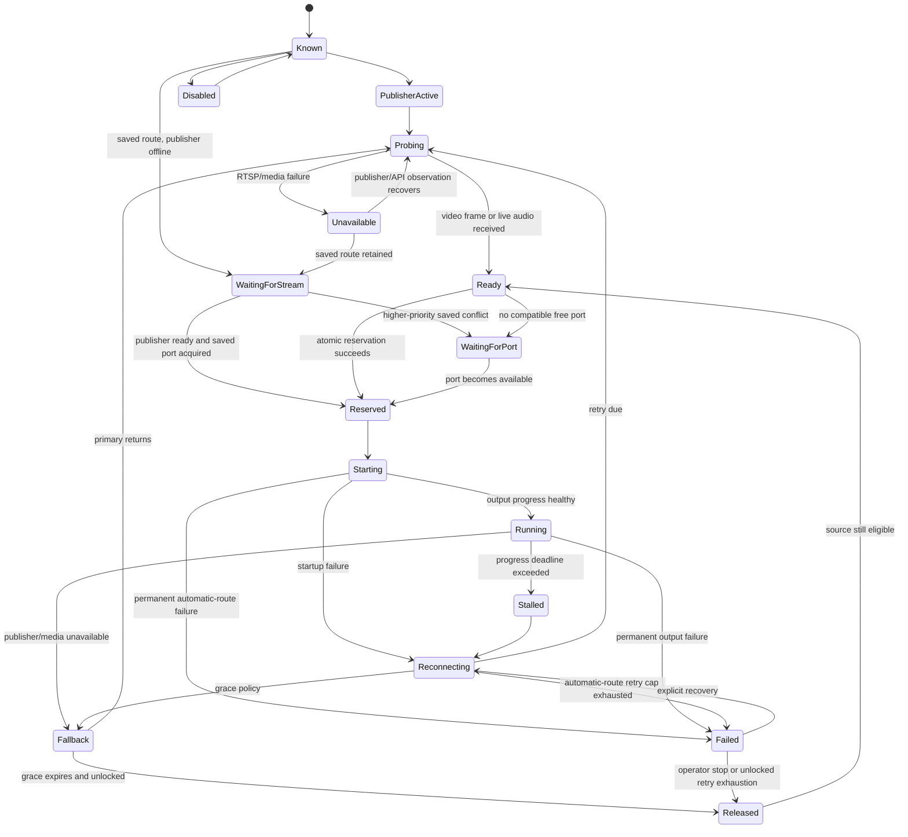

# Route state machine

The state machine separates discovery, media readiness, resource allocation, process startup, steady output, fallback, and recovery.

API-unreachable is server health, not a destructive route transition. Healthy `Running` routes remain running until RTSP/progress or process evidence says otherwise.

Saved preconfigured/manual assignments retain their desired port and preset independently of transient process state. Their ports remain reserved while offline unless temporary automatic use is explicitly enabled. Preconfigured ownership outranks manual ownership; both outrank automatic routes. A lower-priority saved entry remains in `WaitingForPort` with a routing-conflict reason rather than being overwritten.

Preconfigured and manual entries do not lose their retry intent after the automatic-route attempt cap. Stream loss returns the connector to its configured standby owner, while monitoring continues. A recovered publisher or temporary DeckLink/reference condition re-enters probing and startup without changing the output-port designation.

A retry fallback and its replacement live process share one logical source owner but carry different process-purpose tags. When the retry deadline expires, the fallback PID must exit and be reaped before the route enters `Starting`; fallback progress can only report `Fallback` and can never jump a recovering route directly to `Running`. A supervision failure is contained to that source so other routes and discovery continue.

At host startup, saved intent is retained but stale `Running`, PID, frame, and lease fields are cleared before the atomic reservation table is rebuilt. This prevents two persisted entries from restoring the same connector. Every transition is validated; invalid jumps are rejected and logged with source identity and correlation ID.
