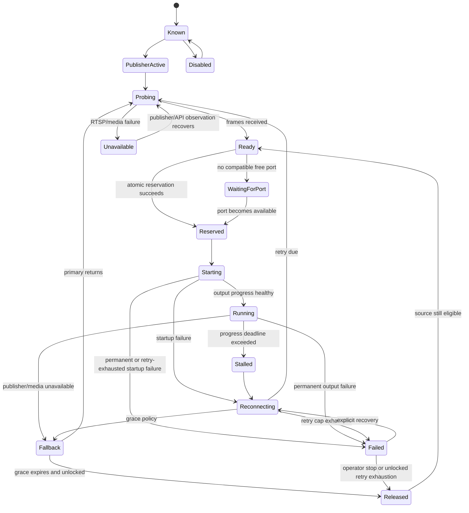

# Route state machine

The state machine separates discovery, media readiness, resource allocation, process startup, steady output, fallback, and recovery.

API-unreachable is server health, not a destructive route transition. Healthy `Running` routes remain running until RTSP/progress or process evidence says otherwise.

Locked assignments retain `Reserved` ownership indefinitely. Unlocked offline routes retain it until their grace deadline, then transition through `Released`. Every transition is validated; invalid jumps are rejected and logged with source identity and correlation ID.
